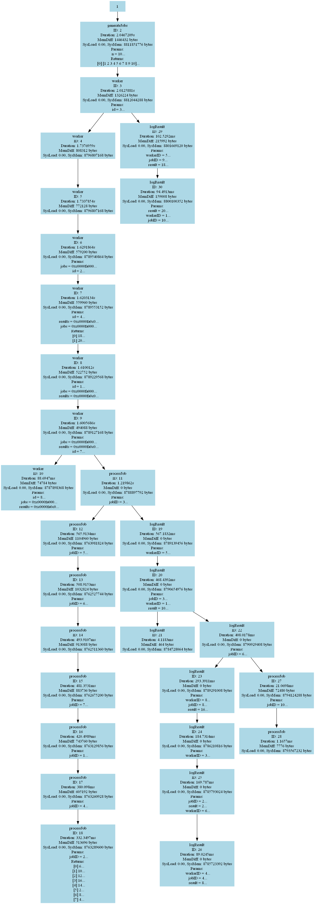

# Concurrency Example Project

This project demonstrates concurrent work in Go using goroutines and channels. It serves as a test case for running the Tracewrap tool against a local project that includes several functions executed concurrently.

## Prerequisites

- Go 1.16 (or later) must be installed.
- The Tracewrap binary must be built and available in the `/bin` folder at the root of the Tracewrap repository.

## Building the Tracewrap Binary

From the root of the Tracewrap repository, build the Tracewrap binary with:

```bash
go build -o bin/tracewrap ./cmd/main.go
```

This command compiles the Tracewrap tool and places the executable in the `/bin` directory.

## tracewrap.yaml Configuration

This project includes a `tracewrap.yaml` file that tells Tracewrap how to instrument and trace the project. This configuration might specify things like:
- Whether tracing is enabled.
- The logging or tracing level.
- Which files or directories to include or exclude.
- The output file for trace logs.

A sample configuration for this project is:

```yaml
# tracewrap.yaml

trace:
  enabled: true
  level: debug
  include:
    - "./**/*.go"
  exclude:
    - []
  output: trace.log
```

Place this file in the root of the `examples/concurrency` directory so that when you run the Tracewrap tool, it picks up the local configuration.

## Running Tracewrap Against This Project

1. **Navigate to the Project Directory:**

   ```bash
   cd examples/concurrency
   ```

2. **Ensure the tracewrap.yaml File is in Place:**

   Confirm that the `tracewrap.yaml` file (as shown above) exists in the project directory.

3. **Run the Tracewrap Tool:**

   From the concurrency project directory, run:

   ```bash
   ../../bin/tracewrap buildTracedApplication --name=concurrency --project . --config tracewrap.yaml
   ```

   This command runs the Tracewrap binary in the context of this project, applying the configuration specified in `tracewrap.yaml`.

## What to Expect

When you run the command, you should see output similar to the following: [tracewrap.log](tracewrap/tracewrap.log).

## Generating and Viewing the Call Graph

After running the Tracewrap command: a `tracewrap` directory will be created with two files:

```
├── tracewrap
│   ├── callgraph.dot
│   └── tracewrap.log
```

### Convert the DOT File to a PNG

If you have **Graphviz** installed, you can convert the `.dot` file to a PNG image:

```bash
dot -Tpng tracewrap/callgraph.dot -o tracewrap/callgraph.png
```

This generates a `callgraph.png` file in the `tracewrap` directory.

### Example Visualization

Here’s what the final call graph might look like (your graph may differ based on the code’s structure and runtime conditions):


