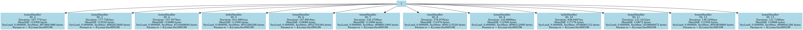

# HTTP Server Tracing Example

This project is a demonstration of a simple HTTP server built with standard Go packages. It has been instrumented with [tracewrap](https://github.com/mwiater/tracewrap) to capture detailed execution traces, including HTTP request handling, asynchronous goroutine activity, and performance metrics.

## Overview

The HTTP Server Tracing Example showcases:
- **Multiple Routes:**  
  The server defines separate endpoints ("/", "/hello", and "/time") to demonstrate various aspects of HTTP request processing.
  
- **Individual Handler Functions:**  
  Each route is implemented in its own function, making it straightforward to trace and debug each handler individually.
  
- **Concurrency with Goroutines:**  
  The example leverages Go’s goroutines to manage asynchronous processing within each request.
  
- **Instrumentation:**  
  When processed with tracewrap, additional instrumentation calls (such as `RecordEntry`, `RecordExit`, and custom tracing for asynchronous operations) can be injected into the source code. This helps verify that request events and goroutine activities are properly recorded in the trace logs and call graph.

## Usage

### Running the Application Normally

To run the application without instrumentation, navigate to the project directory and execute:

```bash
go run main.go
```

You should see output similar to:

```
2025/02/23 10:00:00 Starting server on :8080
```

After starting the server, you can visit the following URLs in your browser to see the different responses:
- [http://localhost:8080/](http://localhost:8080/)
- [http://localhost:8080/hello](http://localhost:8080/hello)
- [http://localhost:8080/time](http://localhost:8080/time)

## Building the Tracewrap Binary

From the root of the Tracewrap repository, build the Tracewrap binary with:

```bash
go build -o bin/tracewrap ./cmd/main.go
```

This command compiles the Tracewrap tool and places the executable in the `/bin` directory.

## tracewrap.yaml Configuration

This project includes a `tracewrap.yaml` file that tells Tracewrap how to instrument and trace the project. This configuration might specify things like:
- Whether tracing is enabled.
- The logging or tracing level.
- Which files or directories to include or exclude.
- The output file for trace logs.

A sample configuration for this project is:

```yaml
# tracewrap.yaml

trace:
  enabled: true
  level: debug
  include:
    - "./**/*.go"
  exclude:
    - []
  output: trace.log
```

## Running Tracewrap Against This Project

1. **Navigate to the Project Directory:**

   ```bash
   cd examples/httpserver
   ```

2. **Ensure the tracewrap.yaml File is in Place:**

   Confirm that the `tracewrap.yaml` file (as shown above) exists in the project directory.

3. **Run the Tracewrap Tool:**

   From the HTTP server project directory, run:

   ```bash
   ../../bin/tracewrap buildTracedApplication --name=httpserver --project . --config tracewrap.yaml
   ```

   This command runs the Tracewrap binary in the context of this project, applying the configuration specified in `tracewrap.yaml`.

## What to Expect

When you run the command, you should see output similar to the following: [tracewrap.log](tracewrap/tracewrap.log).

## Generating and Viewing the Call Graph

After running the Tracewrap command, a `tracewrap` directory will be created with two files:

```
├── tracewrap
│   ├── callgraph.dot
│   └── tracewrap.log
```

### Convert the DOT File to a PNG

If you have **Graphviz** installed, you can convert the `.dot` file to a PNG image:

```bash
dot -Tpng tracewrap/callgraph.dot -o tracewrap/callgraph.png
```

This generates a `callgraph.png` file in the `tracewrap` directory.

### Example Visualization

Here’s what the final call graph might look like (your graph may differ based on the code’s structure and runtime conditions):


```